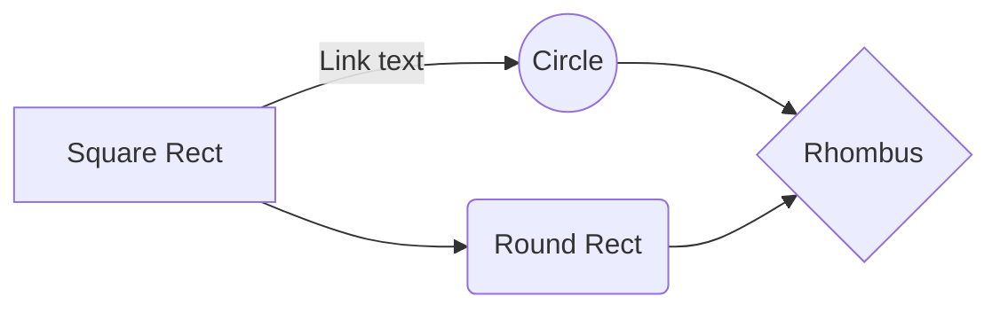

# Heading level 1
## Level 2
## Another level 2
### Level 3
#### Level 4
### Another L3
##### L5

$\Gamma(n) = (n-1)!\quad\forall
n\in\N$ is via the *Euler integral*


$$
\Gamma(z) = \int_0^\infty t^{z-1}e^{-t}dt\,.
$$
[link](Marx)

$(h+r)^2=r^2+t^2$	
$h^2+r^2+2hr=r^2+t^2$
$t^2=h^2+2hr$
$t=\pm\sqrt{h^2+2hr}$
or
$r^2=(h+r)^2-t^2$


$(b+r)^2=(d-t)^2+r^2$
$r^2=(b+r^2)-(d-t)^2$
or
$b^2+r^2+2br=d^2+t^2-2dt+r^2$
$b=-r \pm\sqrt{d^2-2dt+r^2+t^2}$

$(h+r)^2=r^2+t^2$
$h^2+r^2+2hr=r^2+t^2$
$2hr=t^2-h^2$
$r=\frac{t^2-h^2}{2h}$

$(b+r)^2=(d-t)^2+r^2$
$b^2+r^2+2br=d^2+t^2-2dt+r^2$
$2br=d^2+2^2-2dt-b^2$

$r=\frac{d^2+t^2-2dt-b^2}{2b}$

combining the two[^1]
$b/h=\frac{d^2+t^2-dt-b^2}{t^2-h^2}$


$(h+r)^2-t^2=(b+r)^2-(d-t)^2$
$h^2+r^2+2hr-t^2=b^2+r^2+2br+t^2+d^2-2dt$
$h^2+2hr+r^2-r^2-t^2-t^2-d^2+2dt=b^2+2br$
$0=b^2+2br-(h^2+2hr-2t^2-d^2+2dt)$
$0=b^2+2br+(d^2+2t^2-h^2-2hr-2dt)$

The keyboard seems so big now.[^1]
a foot note.

 

 ```javaScript
    let a = 1
012345678911234567892123456789312345679 412345678 512345678 612345678

  ```

[^1]: a foot note.



> Written with [StackEdit](https://stackedit.io/).
<!--stackedit_data:
eyJoaXN0b3J5IjpbLTI3ODUzNjY5OF19
-->